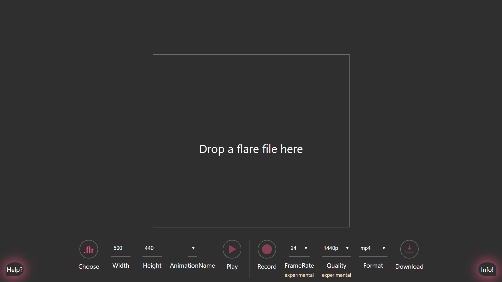

# A simple web app using React to export your Flare(.flr) files into a video. Currently webm and mp4 is supported.

First and foremost a huge shout out for the [www.2dimensions.com](https://www.2dimensions.com/) team. More references and documents to come.

## How it looks

## How to set up locally

Note: This is still a wip progress app. Following instructions might not just work. It is not completely tested.

1. Clone the repo.
2. `cd FlareExporter` or which ever directory you cloned it to.
3. run `npm install`
4. run `npm start`

## How to Use

1. Fiirst choose the flare filer or drag and drop the falre file on to the drop zone marked in big white bordered box.
2. Adjust the canvas width and height to your preferences
3. Choose the type of video to be exported.
4. Type in the animation name which is to be played from the flare file.
   - If the animation name is typed correctly it will start playing the animation.
   - Ensure its the correct animation.
   - It is prefered to have a repeated animation. Otherwise you have to restart the animation and then immediately click the record button.
5. Choose when to start recording the video and click the start recording button.
6. Then stop the recording as and when required.
   > PLease stop the recording within a limited duration. Note that the recorded buffer is part of your javascript memory and could lead to eavy memory usage.
7. Click the download button to download the video in your prefered format.
   > Soon a gif download option will be tried.. :)

## To-Do's

- [ ] Handle buttons disabling logic properly.
- [ ] Give an option to restart the animation on click of the record button. I think this is a good option. If you want to implicitly record the animation from the begining. As of now the the recorder start recording the moment the button is pressed. this is ensure users can record the animation based on how much of the animation is to be recorded.
- [ ] Provide options for alterng video bitrate - currently set to 2.5Mbits/s
- [ ] Enable dowload gif option.
- [ ] Document the code properly and extract components appropriately.
- [ ] Clean Code and imports.
  > Anything you feel required can be added with a PR :D

---

This project was bootstrapped with [Create React App](https://github.com/facebook/create-react-app).

## Available Scripts

In the project directory, you can run:

### `npm start`

Runs the app in the development mode. 
Open [http://localhost:3000](http://localhost:3000) to view it in the browser.

The page will reload if you make edits. 
You will also see any lint errors in the console.

### `npm test`

Launches the test runner in the interactive watch mode. 
See the section about [running tests](https://facebook.github.io/create-react-app/docs/running-tests) for more information.

### `npm run build`

Builds the app for production to the `build` folder. 
It correctly bundles React in production mode and optimizes the build for the best performance.

The build is minified and the filenames include the hashes. 
Your app is ready to be deployed!

See the section about [deployment](https://facebook.github.io/create-react-app/docs/deployment) for more information.

### `npm run eject`

**Note: this is a one-way operation. Once you `eject`, you can’t go back!**

If you aren’t satisfied with the build tool and configuration choices, you can `eject` at any time. This command will remove the single build dependency from your project.

Instead, it will copy all the configuration files and the transitive dependencies (Webpack, Babel, ESLint, etc) right into your project so you have full control over them. All of the commands except `eject` will still work, but they will point to the copied scripts so you can tweak them. At this point you’re on your own.

You don’t have to ever use `eject`. The curated feature set is suitable for small and middle deployments, and you shouldn’t feel obligated to use this feature. However we understand that this tool wouldn’t be useful if you couldn’t customize it when you are ready for it.

## Learn More

You can learn more in the [Create React App documentation](https://facebook.github.io/create-react-app/docs/getting-started).

To learn React, check out the [React documentation](https://reactjs.org/).

### Code Splitting

This section has moved here: https://facebook.github.io/create-react-app/docs/code-splitting

### Analyzing the Bundle Size

This section has moved here: https://facebook.github.io/create-react-app/docs/analyzing-the-bundle-size

### Making a Progressive Web App

This section has moved here: https://facebook.github.io/create-react-app/docs/making-a-progressive-web-app

### Advanced Configuration

This section has moved here: https://facebook.github.io/create-react-app/docs/advanced-configuration

### Deployment

This section has moved here: https://facebook.github.io/create-react-app/docs/deployment

### `npm run build` fails to minify

This section has moved here: https://facebook.github.io/create-react-app/docs/troubleshooting#npm-run-build-fails-to-minify
